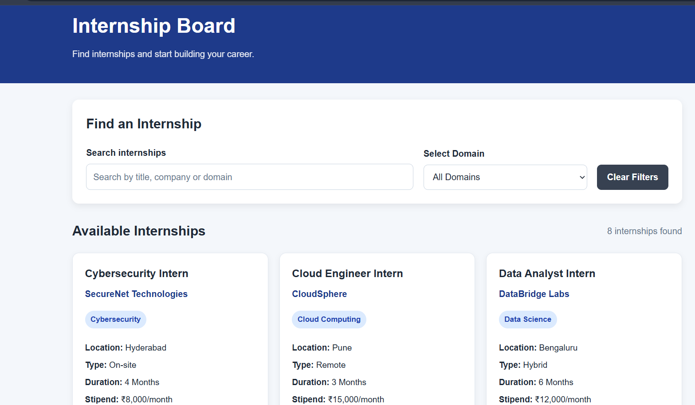
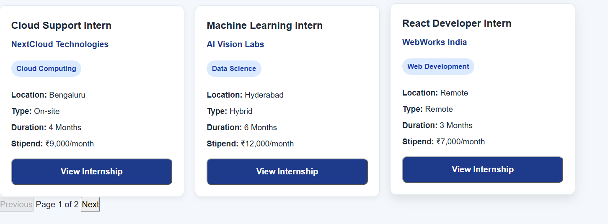
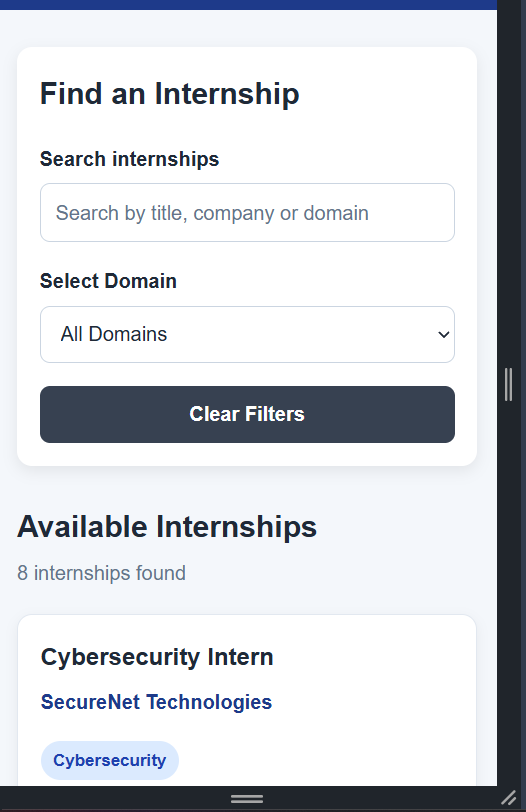

# Responsive Internship Board

A beginner-friendly responsive internship listing platform built using HTML, CSS, JavaScript, Node.js, Express.js and SQLite.

The platform allows users to browse internships, search by keywords, filter by domain and navigate through internship listings using pagination.

---

## Live Demo

### Frontend

[Live Internship Board](https://internship-board-1.onrender.com/)

### Backend API

[Live REST API](https://internship-board-kgql.onrender.com/)

### GitHub Repository

[GitHub Repository](https://github.com/mullapatinagalaxmi-2005/internship-board)

---

## Features

### Frontend

- Responsive design
- Desktop, tablet and mobile layouts
- Internship cards
- Search functionality
- Domain filtering
- Clear filters
- Pagination
- Empty state
- Error state
- Accessible form labels
- Keyboard-friendly controls
- Semantic HTML
- Dynamic internship rendering using JavaScript

### Backend

- Node.js
- Express.js
- REST API
- SQLite database
- CRUD operations
- Input validation
- Search
- Domain filtering
- Pagination
- CORS support
- Individual internship lookup
- Error handling

---

## Technologies Used

### Frontend

- HTML5
- CSS3
- JavaScript

### Backend

- Node.js
- Express.js
- SQLite
- CORS

### Development Tools

- Visual Studio Code
- GitHub
- npm

### Deployment

- Render Static Site
- Render Web Service

---

# REST API

The backend provides a RESTful API for managing internship records.

| Method | Endpoint | Description |
|---|---|---|
| GET | `/api/internships` | Get internships with pagination |
| GET | `/api/internships/:id` | Get a single internship |
| POST | `/api/internships` | Create a new internship |
| PUT | `/api/internships/:id` | Update an internship |
| DELETE | `/api/internships/:id` | Delete an internship |

---

## API Features

### Pagination

Example:

```text
GET /api/internships?page=1&limit=6
```

The API returns pagination information including:

- Current page
- Items per page
- Total internships
- Total pages

Example:

```text
Total internships: 8
Items per page: 6
Total pages: 2
```

### Search

```text
GET /api/internships?search=developer
```

### Domain Filtering

```text
GET /api/internships?domain=Data%20Science
```

### Individual Internship

```text
GET /api/internships/8
```

---

# Internship Information

Each internship record contains:

- Internship title
- Company
- Domain
- Location
- Internship type
- Duration
- Stipend
- Created date

---

# Available Domains

- Web Development
- Data Science
- Cybersecurity
- Cloud Computing
- Java Development

---

# Project Structure

```text
internship-board/

├── frontend/
│   ├── index.html
│   ├── style.css
│   └── script.js
│
├── backend/
│   ├── server.js
│   ├── db.js
│   ├── seed.js
│   ├── package.json
│   ├── package-lock.json
│   │
│   ├── routes/
│   │   └── internships.js
│   │
│   └── middleware/
│       └── validation.js
│
├── data/
│   └── internships.json
│
├── screenshots/
│   ├── desktop.png
│   ├── search-filter.png
│   ├── pagination.png
│   └── mobile.png
│
├── .gitignore
└── README.md
```

---

# Responsive Design

The frontend is designed to work across different screen sizes:

- Desktop
- Tablet
- Mobile

The internship cards automatically adjust according to the available screen width.

---

# Accessibility

The project includes:

- Semantic HTML elements
- Accessible form labels
- Keyboard-friendly controls
- Visible focus states
- Accessible buttons
- Empty states
- Error states

---

# Database

The backend uses SQLite to store internship records.

The database contains:

- Title
- Company
- Domain
- Location
- Type
- Duration
- Stipend
- Created Date

The database is accessed through the Express.js REST API.

---

# Data Seeding

The project includes a seed script that loads internship data into the SQLite database.

Source data:

```text
data/internships.json
```

Seed script:

```text
backend/seed.js
```

---

# Running the Project Locally

## 1. Clone the repository

```bash
git clone https://github.com/mullapatinagalaxmi-2005/internship-board.git
```

## 2. Open the project

```bash
cd internship-board
```

## 3. Install backend dependencies

```bash
cd backend
npm install
```

## 4. Start the backend

```bash
npm start
```

Backend:

```text
http://localhost:5000
```

## 5. Open the frontend

Open:

```text
frontend/index.html
```

in a web browser.

---

# Deployment

## Frontend

The frontend is deployed using Render Static Site.

```text
https://internship-board-1.onrender.com/
```

## Backend

The REST API is deployed using Render Web Service.

```text
https://internship-board-kgql.onrender.com/
```

The frontend communicates with the deployed backend through the REST API.

---

# Task 1 – Responsive Internship Board

Implemented:

- Responsive internship listing interface
- Semantic HTML
- Responsive CSS
- DOM-based rendering
- Internship cards
- Search
- Domain filtering
- Clear filters
- Pagination
- Empty state
- Error state
- Accessible interactions

---

# Task 3 – REST API + Persistent Data

Implemented:

- Node.js backend
- Express.js REST API
- SQLite database
- CRUD operations
- Internship data management
- Input validation
- Search
- Domain filtering
- Pagination
- Individual internship lookup
- CORS support
- Backend deployment

---

# Testing

The deployed API was tested successfully.

Example API result:

```text
Success: true
Total internships: 8
Items per page: 6
Total pages: 2
```

The frontend was tested for:

- Internship loading
- Search
- Domain filtering
- Clear filters
- Pagination
- Responsive layout
- Mobile view
- Empty state
- Error handling

---

# Screenshots

## Desktop View



---

## Search and Domain Filtering


---

## Pagination



---

## Mobile Responsive View



---

# Author

**Mullapati Nagalaxmi**

CSE Student
